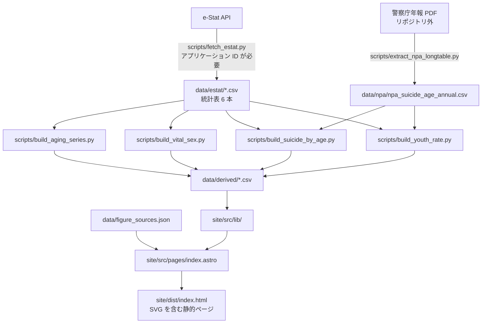

# JP-population-data | 人口減少と若年層の自殺に関する基礎データ

## 概要

https://jp-population-data.pages.dev/

日本政府・各省庁が公開する年齢別人口と自殺に関する統計を、静的サイトで参照できる形にまとめたリポジトリです。数値の出所、加工手順、サイトのビルド手順を確認できます。

当リポジトリ・Web サイトは "自殺" や "年齢別の人口" のデータを取り扱いますが、特定の主張やその支持をするものではありません。

自殺死亡率は、公表されている自殺者数と人口をもとに**このリポジトリが算出した値**です。

フォークやクローンなどを行う場合は、[e-Stat 利用規約](https://www.e-stat.go.jp/terms-of-use)等に従い、慎重に取り扱って下さい。

## 技術スタック

| 用途 | 技術 |
|---|---|
| サイト生成 | Astro 7.3.2 |
| 作図 | Observable Plot 0.6.17 |
| ビルド時 DOM | linkedom 0.18.13 |
| 型検査 | TypeScript 5.9.3、`@astrojs/check` 0.9.10 |
| 実行環境 | Node.js 24.11.0、npm 11.6.1、Python 3.13.9 |
| PDF 抽出 | pdfplumber 0.11.10、PyMuPDF 1.28.2 |
| xlsx 読み取り | openpyxl 3.1.5 |
| HTTP | requests 2.34.2 |
| 開発 OS | Windows 11 Pro (10.0.26200) |
| 検査に使うブラウザ | Google Chrome 152.0.7977.84（ヘッドレス） |
| 依存関係 | Node.js: `site/.nvmrc`, `site/package.json`, Python: `requirements.txt` |

## サイト構成

サイトには、データを示す 10 区切りと 15 枚の図があります。図はビルド時に SVG として生成するため、閲覧側でグラフライブラリを実行しません。

| 区切り | 図 | 枚数 |
|---|---|---:|
| 年齢 3 区分の人口 | 年少・生産年齢・老年の人数 | 1 |
| 年齢 3 区分の構成比 | 同じ 3 区分の割合 | 1 |
| 出生数と死亡数と自然増減 | 3 系列 | 1 |
| 合計特殊出生率 | 1 系列 | 1 |
| 年齢階級別の自殺者数 | 年齢帯ごとの実数 | 1 |
| 年齢階級別の自殺死亡率 | 同じ年齢帯の人口 10 万対 | 1 |
| 0-19 歳の自殺者数 | 分子 | 1 |
| 0-19 歳の人口 | 分母 | 1 |
| 0-19 歳の自殺死亡率 | 率 | 1 |
| 年齢階級別の男女別自殺死亡率 | 0-19、20-29、30-39、40-49、50-59、60 歳以上 | 6 |

各図の下に、その図に描かれている数値そのものを表で載せています。

## ファイル構成

| 場所 | 内容 |
|---|---|
| `data/estat/` | e-Stat から取得した 6 統計表と、その取得記録 `_meta.csv` |
| `data/npa/` | 警察庁年報から抽出した年齢階級別の長期表 |
| `data/derived/` | 加工済み CSV。6 本のうち、サイトは 5 本を読む |
| `data/sources_manifest.csv` | 一次ファイルの取得元 URL と SHA-256 |
| `data/figure_sources.json` | 図 ID と一次入力、URL、表題の対応 |
| `docs/` | 出典と、何を見ていて何を見ていないかの文書 |
| `scripts/` | 取得、抽出、加工、検査の Python スクリプト |
| `site/src/lib/` | CSV を読む層 |
| `site/src/pages/` | ページと図の生成 |
| `site/src/components/`、`site/src/layouts/` | 図とページの部品 |
| `site/src/styles/` | 配色と版面 |
| `site/scripts/` | ビルド済みページを対象にする検査 |
| `site/public/` | そのまま配信するファイル。`_headers` が配信側の CSP を定義する。Astro の CSP 機能は使わず、`Base.astro` が `csp-policy.mjs` の文字列から meta CSP を出す |

`site/src/lib/` は `process.cwd()` を基準に `../data/derived/` を読むため、`site/` と `data/` の相対位置を変えずにビルドしてください。

## 一次データ・及び取得元

| 内容 | 場所 |
|---|---|
| 一次データの一覧 | [docs/SOURCES.md](docs/SOURCES.md) |
| 警察庁年報の掲載状況 | [docs/NPA_SUICIDE_SOURCE_RESULT.md](docs/NPA_SUICIDE_SOURCE_RESULT.md) |
| 取得元 URL と SHA-256 | [data/sources_manifest.csv](data/sources_manifest.csv) |
| 年報 PDF | リポジトリに含めない。URL とハッシュは上記 |

e-Stat API を使用するには、登録時に発行される e-Stat のアプリケーション ID が必要です。

## データの流れ



各加工スクリプトが読む一次入力は次表のとおりです。これらのスクリプトは、コミット済みの入力から派生 CSV を作ります。

| スクリプト | 読む入力 | 出力 |
|---|---|---|
| `scripts/build_aging_series.py` | `data/estat/pop_age3_longterm.csv`、`data/estat/pop_total_single_age_annual.csv`、`data/estat/pop_total_5y_2025.csv`、`data/estat/vital_births_rates.csv`、`data/estat/vital_deaths_rates.csv` | `data/derived/aging_age_structure.csv`、`data/derived/aging_vital_change.csv` |
| `scripts/build_suicide_by_age.py` | `data/npa/npa_suicide_age_annual.csv`、`data/estat/pop_total_single_age_annual.csv`、`data/estat/pop_total_5y_2025.csv` | `data/derived/suicide_by_age_rate.csv` |
| `scripts/build_vital_sex.py` | `data/estat/vital_suicide_age_sex.csv`、`data/estat/pop_total_single_age_annual.csv` | `data/derived/vital_suicide_by_age_sex_rate.csv` |
| `scripts/build_youth_rate.py` | `data/npa/npa_suicide_age_annual.csv`、`data/estat/pop_total_single_age_annual.csv`、`data/estat/pop_total_5y_2025.csv` | `data/derived/youth_suicide_rate.csv` |

## 主要ロジック

| 種別 | ファイル | 役割 |
|---|---|---|
| 取得 | `scripts/fetch_estat.py` | e-Stat API から統計表を取得する。`ESTAT_APP_ID` をアプリケーション ID として受け取る |
| 抽出 | `scripts/extract_npa_longtable.py` | 警察庁年報 PDF から年齢階級別の長期表を抽出する |
| 加工 | `scripts/build_aging_series.py` | 年齢 3 区分の人数と構成比、出生・死亡・自然増減、合計特殊出生率を作る |
| 加工 | `scripts/build_suicide_by_age.py` | 年齢帯別の自殺者数と人口 10 万対の率を作る |
| 加工 | `scripts/build_vital_sex.py` | 人口動態統計から男女別・年齢帯別の率を作る |
| 加工 | `scripts/build_youth_rate.py` | 0-19 歳の自殺者数、人口、率を作る |
| 検査 | `scripts/verify_rederivation.py` | 一次入力から派生 CSV を 2 回作り直し、コミット済み CSV と互いの出力を比べる。値、行、列が違えば対象の行・列と値が出る |
| 検査 | `scripts/verify_derived_invariants.py` | 派生 CSV の中で成り立つはずの等式を計算し直す。自然増減が出生数と死亡数の差になっているかなどを見て、合わなければその行が出る |
| 検査 | `scripts/verify_figures.py` | ビルド済み HTML の図の点・軸・凡例・座標を派生 CSV と図の定義に比べる。足りない要素や値、座標が合わなければ図 ID と条件が出る |
| 検査 | `scripts/verify_figure_sources.py` | 図の帰属文を `data/figure_sources.json` と突き合わせる。表題、省庁名、URL が違えば該当する図と項目が出る |
| 検査 | `scripts/verify_pdf_extraction.py` | 同じ PDF から 2 回抽出した CSV とコミット済み CSV を比べる。ハッシュ、行、列、値が違えば差が出る。PDF が無い場合は `SKIPPED` と出る |
| 検査 | `site/scripts/verify-figure-table-values.mjs` | 各図の SVG の点と直下の数値表を、図 ID・年・系列・指標ごとに比べる。値の違い、点の欠落、重複があればその組を出す |
| 検査 | `site/scripts/verify-csp.mjs` | 2 層に置いた CSP の文字列が食い違っていないか見る。片方だけ書き換えると落ちる |
| 検査 | `site/scripts/verify-no-horizontal-overflow.mjs` | ヘッドレスブラウザで各画面幅の文書幅とスクロール幅を比べる。横方向にはみ出すと幅と要素が出る |
| 検査 | `site/scripts/verify-rule-contrast.mjs` | 明暗両テーマの罫線・グリッド線の色と背景色からコントラスト比を計算する。基準外ならテーマ、要素、比が出る |
| 検査 | `site/scripts/verify-series-styles.mjs` | 図で描く系列名と `seriesStyles` の定義を突き合わせる。定義のない系列名があれば出る |

配信側が返すヘッダは `site/public/_headers` に置き、meta はヘッダを送らない経路で開いたページを対象にします。`frame-ancestors` は meta では効かないため、ヘッダ層が必要です。両方の文字列は `site/src/csp-policy.mjs` から出します。

何を見ていて、何を見ていないかは [docs/VERIFY.md](docs/VERIFY.md) にあります。

依存パッケージの導入とサイトのビルドは、`site/` で行います。

```
npm ci
npm run build
```

`npm ci` は `package-lock.json` に固定された版をそのまま入れます。

Python の検査を動かす場合は、リポジトリ直下で依存パッケージを導入します。

```
pip install -r requirements.txt
```

## License

| 対象 | ライセンス |
|---|---|
| コード | [MIT License](LICENSE) |
| 文章、図、派生データ | [CC BY 4.0](https://creativecommons.org/licenses/by/4.0/) |
| e-Stat のデータ | [e-Stat 利用規約](https://www.e-stat.go.jp/terms-of-use)（政府標準利用規約 第 2.0 版に準拠） |

各図の出典欄には、`「○○調査結果」（A省）を加工して作成` の形で加工した旨を明記しています。
